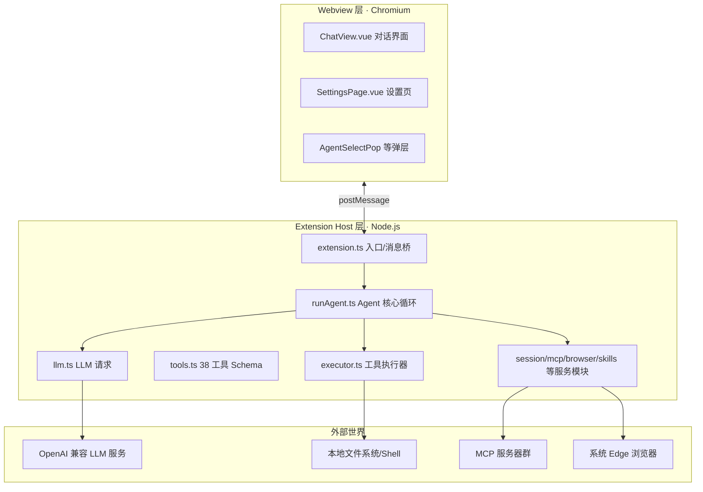
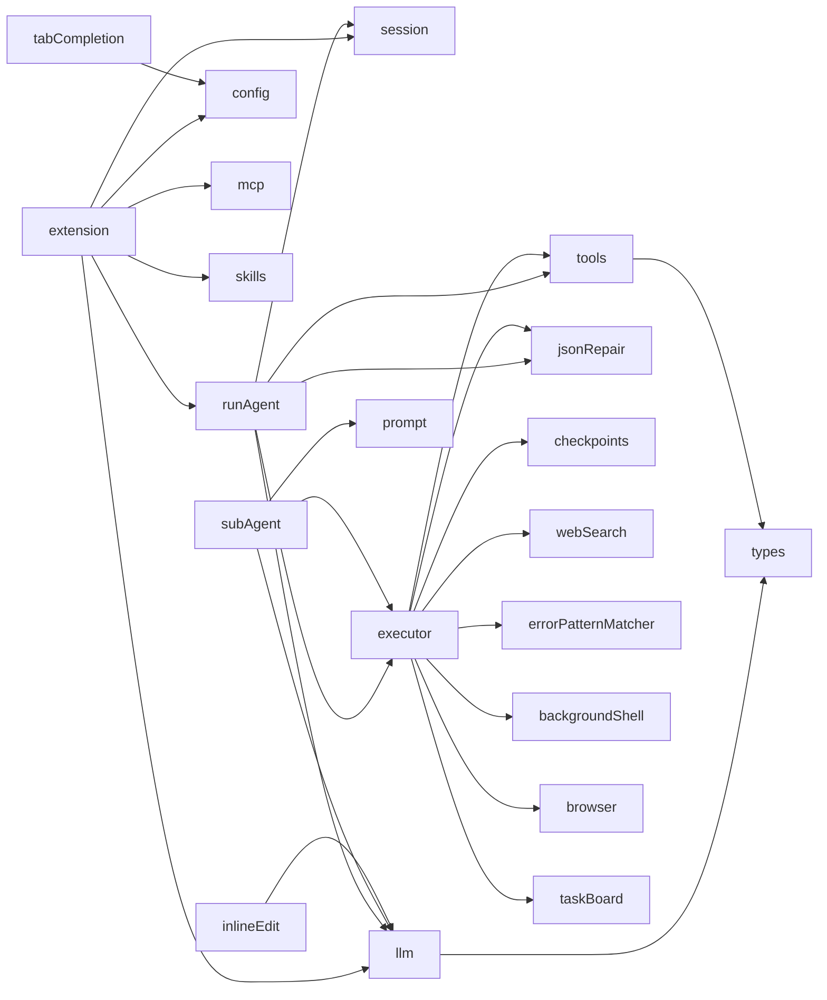

# Codex CN 项目开发环境与配置文档

> **文档版本**：v1.0
> **最后更新**：2026-10-04
> **适用分支**：`codex-cn/custom`
> **最新提交**：`f7e7d2b6a28`
> **用途**：新电脑环境迁移、二次开发交接、配置留档。敏感信息已全部脱敏。

---

## 目录

1. [项目概述](#1-项目概述)
2. [开发环境配置说明](#2-开发环境配置说明)
3. [项目配置详情](#3-项目配置详情)
4. [文件功能说明](#4-文件功能说明)
5. [开发过程记录](#5-开发过程记录)
6. [开发进度说明](#6-开发进度说明)
7. [二次开发指南](#7-二次开发指南)
8. [附录](#8-附录)

---

## 1. 项目概述

**Codex CN** 是基于 VS Code（Code - OSS）中文定制分支的国产 AI 编程助手扩展，全部代码位于仓库的 `extensions/codex-cn/` 目录下，以独立扩展形式存在，不改动 VS Code 核心源码。

- **形态**：VS Code 扩展（Extension Host 进程运行）+ Vue 3 Webview 界面
- **核心能力**：LLM Agent 循环（工具调用）、38 个内置工具、MCP 外部工具生态、浏览器自动化、子 Agent、语义级历史压缩、单步调试
- **兼容协议**：OpenAI Chat Completions（`/chat/completions`），可接入任意 OpenAI 兼容服务
- **架构原则**：分层解耦、依赖注入、弱模型降级容错、确定性故障规则化自愈

### 整体架构图



---

## 2. 开发环境配置说明

### 2.1 操作系统

| 项目 | 版本 |
|------|------|
| 操作系统 | **Microsoft Windows 11 专业版** |
| 内核版本 | Windows NT 10.0.26100（24H2） |
| 时区 | Asia/Shanghai（UTC+8） |
| 系统编码 | UTF-8（命令执行时显式 `chcp 65001`） |

> 理论上跨平台（macOS/Linux）可运行，但浏览器工具依赖系统 Edge 路径、命令执行依赖 `cmd.exe`，当前为 **Windows 专用实现**。

### 2.2 开发工具及版本

| 工具 | 当前版本 | 用途 | 备注 |
|------|---------|------|------|
| **Node.js** | `v24.18.1` | 扩展运行时、构建执行 | 建议 ≥ 20，内置 fetch/ES2024 |
| **npm** | `11.16.0` | 依赖管理 | 随 Node 安装 |
| **Git** | `2.55.0.windows.2` | 版本管理 | 需支持长路径 |
| **PowerShell** | `5.1.26100.9444` | 同步脚本执行 | 系统自带；可选装 PS7 |
| **gulp** | 仓库内置（`build/gulpfile.extensions.mjs`） | TS 编译 | 用 `npx gulp` 调用，无需全局安装 |
| **esbuild** | `0.28.2`（扩展 devDependency） | Webview 打包 | 需执行 postinstall 安装平台二进制 |
| **VS Code（宿主）** | 1.140.x（`D:\VSCode-win32-x64`） | 扩展运行容器 | zip 绿色版，非系统安装版 |
| **编辑器** | Trae CN / VS Code | 写源码 | 打开目录 `d:\codex-cn-oss` |

### 2.3 三个工作目录（重要）

项目横跨 3 个位置，各自职责不可合并：

| # | 路径 | 角色 | 说明 |
|---|------|------|------|
| ① | `d:\codex-cn-oss\` | **源码工厂** | git 仓库，含全部 TS/Vue 源码；编译产物落在 `extensions\codex-cn\out\` 与 `dist\` |
| ② | `D:\VSCode-win32-x64\` | **成品车间** | 可运行的整个 VS Code（绿色版），入口 `Codex CN.exe`；扩展加载路径 `resources\app\extensions\codex-cn\` |
| ③ | `C:\Users\蒋奎\AppData\Roaming\Codex CN\` | **用户档案柜** | 设置、会话、技能、密钥等用户数据 |

**为什么不能合并**：TS/Vue 必须编译后才能运行；VS Code 只从②加载扩展；用户数据必须独立于程序和源码，重装/换机不丢失。

**① → ② 的同步**：由仓库根目录的 [sync-extension.ps1](file:///d:/sync-extension.ps1) 完成（复制 out/dist/vendor/package.json/media）。

> **优化项（可选）**：可把 ② 中的扩展目录创建为指向 ① 的目录联接（Junction），实现编译后免同步：
> `New-Item -ItemType Junction -Path "D:\VSCode-win32-x64\resources\app\extensions\codex-cn" -Target "d:\codex-cn-oss\extensions\codex-cn"`
> （执行前需先删除/改名原目录，重载验证异常可随时撤销。）

### 2.4 环境变量配置

| 变量 | 值 | 设置位置 | 用途 |
|------|------|---------|------|
| `PYTHONIOENCODING` | `utf-8` | `backgroundShell.ts` spawn 时注入 | Python 子进程输出 UTF-8 |
| `PYTHONUTF8` | `1` | `backgroundShell.ts` spawn 时注入 | Python 强制 UTF-8 模式 |
| `ELECTRON_RUN_AS_NODE` | （执行修复命令时清除） | `errorPatternMatcher.ts` | 防止 Electron 纯 Node 模式污染子进程 |

无需在系统层面配置任何环境变量；上面的变量均由代码在启动子进程时按需注入。

### 2.5 用户数据目录结构（③）

```
C:\Users\蒋奎\AppData\Roaming\Codex CN\
├─ User\
│  └─ settings.json                 ← 全部 codex-cn.* 配置
├─ globalStorage\
│  ├─ codex-cn\
│  │  └─ ...                        ← 由扩展 globalState 管理（任务板等）
│  ├─ skills\*.md                   ← 用户自定义技能真实文件
│  └─ user_memory.md                ← 跨会话用户记忆
└─ ...（SecretStorage 系统加密区）   ← API Key 存放处
```

---

## 3. 项目配置详情

### 3.1 配置参数总表

全部配置位于 VS Code 工作区配置，前缀 `codex-cn.`，定义于 [package.json](file:///d:/extensions/codex-cn/package.json) 的 `contributes.configuration`：

| 配置键 | 类型 | 默认值 | 说明 |
|--------|------|--------|------|
| `provider` | string | `doubao` | 模型提供商（见 3.3） |
| `baseUrl` | string | 火山 v3 地址 | OpenAI 兼容 API 根地址 |
| `model` | string | `doubao-pro-32k` | 模型名称 |
| `supportsTools` | string | `auto` | 工具调用支持：`auto`/`yes`/`no`；auto 时遇 400 自动降级 |
| `autoApprove` | boolean | `true` | 全部写操作/命令（含危险命令）自动放行 |
| `planMode` | boolean | `false` | 计划确认模式：先提交方案再执行 |
| `stepMode` | boolean | `false` | 单步模式：每轮决策前暂停 |
| `superpowers` | boolean | `false` | Superpowers 方法论（头脑风暴→规格→TDD→评审） |
| `mcpServers` | object | `{}` | MCP 服务器配置（stdio/http） |
| `tabCompletion` | boolean | `true` | Tab 行内代码补全 |
| `toolRead` | boolean | `true` | 读取类工具总开关 |
| `toolWrite` | boolean | `true` | 写入类工具总开关 |
| `toolShell` | boolean | `true` | 命令执行类工具总开关 |
| `toolBrowser` | boolean | `true` | 浏览器类工具总开关 |
| `toolWeb` | boolean | `true` | 联网类工具总开关 |
| `privacyMode` | boolean | `false` | 隐私模式：阻止联网外发 |
| `maxMessages` | number | `100`（20–500） | 单会话保留消息条数 |
| `autoTitle` | boolean | `true` | 首条消息自动生成会话标题 |
| `maxSessions` | number | `60`（10–200） | 历史会话保留上限 |

### 3.2 当前用户 settings.json（脱敏实拍）

文件位置：`C:\Users\蒋奎\AppData\Roaming\Codex CN\User\settings.json`

```json
{
    "codex-cn.provider": "volcesPlan",
    "codex-cn.baseUrl": "https://ark.cn-beijing.volces.com/api/plan/v3",
    "codex-cn.model": "ark-code-latest",
    "codex-cn.autoApprove": true,
    "codex-cn.supportsTools": "auto",
    "codex-cn.tabCompletion": true,
    "codex-cn.toolShell": true,
    "codex-cn.privacyMode": false,
    "codex-cn.maxSessions": 60,
    "codex-cn.autoTitle": true,
    "codex-cn.maxMessages": 100,
    "codex-cn.planMode": false,
    "codex-cn.stepMode": false,
    "codex-cn.superpowers": false,
    "codex-cn.mcpServers": {}
}
```

### 3.3 第三方服务接入信息

#### 模型提供商预设（`PROVIDER_PRESETS`，[config.ts](file:///d:/extensions/codex-cn/src/config.ts)）

| 提供商 | 标签 | Base URL | 默认模型 |
|--------|------|----------|---------|
| `doubao` | 豆包（火山引擎） | `https://ark.cn-beijing.volces.com/api/v3` | `doubao-pro-32k` |
| `volcesPlan` | 火山引擎 Coding Plan | `https://ark.cn-beijing.volces.com/api/plan/v3` | `ark-code-latest` |
| `deepseek` | DeepSeek | `https://api.deepseek.com/v1` | `deepseek-chat` |
| `qwen` | 通义千问 | `https://dashscope.aliyuncs.com/compatible-mode/v1` | `qwen-plus` |
| `kimi` | Kimi（月之暗面） | `https://api.moonshot.cn/v1` | `moonshot-v1-8k` |
| `zhipu` | 智谱 GLM | `https://open.bigmodel.cn/api/paas/v4` | `glm-4-flash` |
| `openai` | OpenAI 官方 | `https://api.openai.com/v1` | `gpt-4o` |
| `llama` | llama.cpp 本地 | `http://127.0.0.1:8080/v1` | `local-model` |
| `ollama` | Ollama 本地 | `http://127.0.0.1:11434/v1` | `qwen3:8b` |
| `custom` | 自定义 | （用户填写） | （用户填写） |

#### API Key（敏感信息 · 脱敏）

| 项目 | 说明 |
|------|------|
| 存储位置 | VS Code **SecretStorage**（系统级加密落盘），键名 `codex-cn.apiKey` |
| 存取接口 | `getApiKey(secrets)` / `saveApiKey(secrets, key)`（[config.ts](file:///d:/extensions/codex-cn/src/config.ts)） |
| 请求方式 | HTTP Header `Authorization: Bearer {apiKey}` |
| 火山引擎 Key 格式示例（脱敏） | `ark-xxxxxxxx-xxxx-xxxx-xxxx-xxxxxxxxxxxx`（真实 Key 不落任何文档） |
| GitHub PAT 格式示例（脱敏） | `ghp_****************************` |

> **数据安全约定**：真实密钥只存 SecretStorage，不写配置文件、不写日志、不进 git；换机时需重新录入。

#### 火山引擎 Coding Plan 注意事项

- 该服务**不实现** OpenAI 兼容的 `/models` 端点（返回 404 属正常），设置页「测试获取模型」按钮会提示手动填写。
- `/chat/completions` 正常可用；降级到无 tools 模式时，请求体中必须剥离 `tool_calls` / `tool_call_id` 字段，否则报 400。

### 3.4 默认 MCP 服务器

扩展启动时（[extension.ts](file:///d:/extensions/codex-cn/src/extension.ts)）自动注入以下默认配置，与用户在 `codex-cn.mcpServers` 中的自定义配置合并（同名时用户配置优先）：

| 服务器名 | 启动命令 | 所需额外条件 |
|---------|---------|-------------|
| `sequential-thinking` | `npx -y @modelcontextprotocol/server-sequential-thinking` | 无 |
| `playwright` | `npx -y @playwright/mcp@latest --headless` | 首次调用自动下载浏览器（约 200MB） |
| `chrome-devtools` | `npx -y chrome-devtools-mcp@latest --headless` | 系统已装 Chrome |
| `context7` | `npx -y @upstash/context7-mcp` | 无（远程文档检索） |
| `filesystem` | `npx -y @modelcontextprotocol/server-filesystem {工作区根目录}` | 无 |
| `github` | `npx -y @modelcontextprotocol/server-github` | 需在 env 填 `GITHUB_PERSONAL_ACCESS_TOKEN` |

> 首次启动 npx 会临时下载包，连接状态可能先「连接中（黄）」后「已连接（绿）」；失败的服务器在「设置 → MCP 工具」卡片上显示错误详情，不阻断其他功能。

### 3.5 配置存储机制一览

| 数据类别 | 存储机制 | 落盘位置 |
|---------|---------|---------|
| 非敏感配置（19 项） | `vscode.workspace.getConfiguration` | ③ `User\settings.json` |
| API Key | `SecretStorage`（加密） | ③ 系统加密区 |
| 会话消息/摘要 | `globalState`（Memento） | ③ `globalStorage` |
| 任务规划板 | `globalState`，键 `codex-cn.taskboard` | ③ `globalStorage` |
| 用户技能 | 真实 `.md` 文件 | ③ `globalStorage\skills\` |
| 用户记忆 | `user_memory.md` | ③ `globalStorage\` |
| 错误规则库 | 随扩展分发的静态 JSON | `error-patterns.json` |

---

## 4. 文件功能说明

### 4.1 完整目录树

```
d:\codex-cn-oss\
├─ sync-extension.ps1                    # 扩展同步脚本（① → ②）
└─ extensions\codex-cn\
   ├─ package.json                       # 扩展清单（命令/配置/视图）
   ├─ package-lock.json                 # 依赖锁定
   ├─ tsconfig.json                      # TS 编译配置
   ├─ esbuild.webview.mts               # webview 打包脚本
   ├─ error-patterns.json               # 错误自愈规则库
   ├─ docs\
   │  └─ 项目开发环境与配置文档.md       # 本文档
   ├─ media\
   │  └─ icon.svg                        # 侧栏容器图标
   ├─ vendor\superpowers\skills\         # 内置 Superpowers 技能集（62 文件）
   ├─ src\                               # ── 扩展宿主源码（21 TS 模块）──
   │  ├─ extension.ts                    # 扩展入口
   │  ├─ runAgent.ts                     # Agent 核心循环
   │  ├─ executor.ts                     # 工具执行器
   │  ├─ tools.ts                        # 工具 Schema 与摘要
   │  ├─ types.ts                        # OpenAI 共享类型
   │  ├─ llm.ts                          # LLM 请求/流式/降级
   │  ├─ config.ts                       # 配置与密钥
   │  ├─ session.ts                      # 会话状态与持久化
   │  ├─ prompt.ts                       # 系统提示词
   │  ├─ mcp.ts                          # MCP 客户端
   │  ├─ jsonRepair.ts                   # 容错 JSON 修复
   │  ├─ errorPatternMatcher.ts          # 错误自愈规则引擎
   │  ├─ checkpoints.ts                  # 文件快照回滚
   │  ├─ taskBoard.ts                    # 任务规划板
   │  ├─ backgroundShell.ts              # 后台 Shell 进程池
   │  ├─ browser.ts                      # 内置浏览器（Edge CDP）
   │  ├─ webSearch.ts                    # 联网搜索
   │  ├─ skills.ts                       # 技能库管理
   │  ├─ subAgent.ts                     # 子 Agent 管理
   │  ├─ tabCompletion.ts                # Tab 代码补全
   │  └─ inlineEdit.ts                   # Ctrl+K 行内编辑
   └─ src\webview\                       # ── Webview 源码（Vue 3）──
      ├─ main.ts                          # Webview 入口/打包挂载
      ├─ App.vue                          # 根组件
      ├─ styles.css                       # 全部界面样式
      └─ components\
         ├─ ChatView.vue                  # 对话主界面
         ├─ SettingsPage.vue              # 设置页
         └─ AgentSelectPop.vue            # Agent/Chat 模式弹层
   ├─ out\                                # 【产物】TS→JS（gitignore）
   └─ dist\                               # 【产物】webview.js/css（gitignore）
```

### 4.2 宿主源码模块说明（src/*.ts）

#### extension.ts —— 扩展入口 / 消息桥
- **功能**：`activate()` 初始化全部有状态服务（会话管理、技能、记忆、任务板、后台 Shell、浏览器、MCP、子 Agent），注册侧栏 Webview 与编辑器标签页，处理 Webview ↔ 宿主的全部消息。
- **核心逻辑**：
  - 启动时展开辅助栏并聚焦聊天面板；自动注入 6 个默认 MCP 配置；
  - `send()`：组装 `AgentDeps`（依赖注入容器）→ 调 `runAgent()`；
  - 暂停/继续/单步闸门（Promise 挂起）、空闲/运行两路手动压缩、`DiffContentProvider`（vscode.diff 自定义内容）；
  - 消息类型：`ready/send/stop/pause/resume/compressNow/saveConfig/fetchModels/mcp*` 等。
- **关联**：几乎所有模块的装配中心。

#### runAgent.ts —— Agent 核心循环（项目心脏）
- **功能**：LLM → 工具调用 → 执行 → 结果回喂 → 继续，直到模型给出最终回复。
- **核心逻辑**：
  - `SemanticStuckDetector`：工具参数指纹（规范化 JSON 哈希）去重、错误指纹追踪、只读 streak，检测死循环；
  - 重读/搜索螺旋硬拦截（未变更文件重读、同 query ≥3 次）；
  - `DegradationChain`：native→XML→JSON→纯文本三级降级 + prompt_patch 回喂；
  - `semanticCompress()`：历史语义压缩（LLM 摘要优先、机械摘要兜底）；
  - `planFoldRange()/buildSessionTranscript()/buildMechanicalSummary()`：折叠规划与摘要构造；
  - `buildMessages()`：session 数据 → OpenAI 消息协议（含摘要替换、tool_calls/tool 配对）。
- **关联**：被 extension.ts 调用；使用 executor/llm/tools/session 等全部服务（通过 `AgentDeps` 注入）。

#### executor.ts —— 工具执行器
- **功能**：38 个内置工具的真实执行。
- **核心逻辑**：
  - 文件读写走 `vscode.workspace.fs`；写/改/删前自动 `saveCheckpoint`；
  - 文件读取指纹缓存（`path:start:end` + mtime）防重读；
  - `run_command` 用 child_process；`isLongRunningCmd()` 识别 `npm run dev` 等持续命令并 spawn 后台启动；超时全部为 0（无限制）；
  - Python 发现：py launcher 兜底 PATH 损坏；
  - 审批钩子 `requestApproval`（当前恒为自动放行）；错误经 `ErrorPatternMatcher` 自愈后重试。
- **关联**：tools.ts（工具分组/参数摘要）、checkpoints、webSearch、errorPatternMatcher、jsonRepair、backgroundShell、browser、taskBoard。

#### tools.ts —— 工具协议
- **功能**：38 个工具的 OpenAI function calling JSON Schema；工具分组常量（READ/WRITE/BROWSER/PLAN_TOOLS）；`summarizeArgs`/`summarizeResult` 参数与结果摘要。
- **关联**：被 runAgent（发送 schema）、executor（执行/摘要）、subAgent 共同引用。

#### llm.ts —— LLM 请求层
- **功能**：调用 `/chat/completions`；流式 SSE 解析（content 与 tool_calls 按 index 累积）；400/500 自动降级。
- **核心逻辑**：`buildXmlDegradedMessages()`（XML 协议合并进首条 system，剥离 tool_calls/tool_call_id）；截断错误识别（参数过长 JSON 不完整）；`maxTokens` 可覆盖（摘要 1200，默认 16384）。
- **关联**：被 runAgent/inlineEdit/subAgent/extension 的摘要功能复用。

#### types.ts —— 共享类型
- `ChatMessage` / `ToolCall` / `ChatCompletionTool` / `ChatResult`（含 degraded/truncated 标记）。

#### config.ts —— 配置与密钥
- `PROVIDER_PRESETS` 提供商预设；`getLLMConfig`；`applyProviderPreset`；`setConfig`；`getApiKey/saveApiKey`；`getAgentSettings()`（拦截点实时读取，设置即时生效）。

#### session.ts —— 会话状态
- `Session`（消息 + `ConversationSummary[]` 摘要，自动持久化、超限裁剪并平移摘要索引）；`SessionManager`（多会话 CRUD、标题、上限淘汰）；`globalState` 落盘。

#### prompt.ts —— 系统提示词
- `buildSystemPrompt()`：强制六步工作流 / Superpowers 方法论二选一、最高优先级铁律（中文、连续执行、简短思考）、项目规则（`AGENT_RULES.md`/`.codexcrules`/`.cursorrules`）、技能索引、用户记忆注入。

#### mcp.ts —— MCP 客户端
- stdio（Content-Length 分帧）与 Streamable HTTP 双传输；JSON-RPC 2.0；initialize→tools/list→tools/call；`McpManager` 多服务器聚合与状态广播。

#### jsonRepair.ts —— JSON 容错
- `repairJson()` 状态机修复未转义引号/控制字符；`parseXmlToolCalls()`（兼容单双引号、转义引号）；`parseJsonToolCalls()`（content 内嵌 JSON 回退）。

#### errorPatternMatcher.ts —— 错误自愈引擎
- stderr 正则 + 上下文标签匹配规则库；置信度分级处置（≥0.9 自动修复重试，0.6–0.89 喂模型）；`RepairPipeline` 多步修复管线（成功判定/分支）；PowerShell EncodedCommand 避免引号转义。

#### checkpoints.ts —— 快照回滚
- 写操作前保存旧内容（含"文件不存在"占位，上限 100）；QuickPick 选择恢复。

#### taskBoard.ts —— 任务规划板
- `todo_write` 的存储（globalState，上限 100）；P0/P1 与 done/running/error 状态统计。

#### backgroundShell.ts —— 后台 Shell
- `await_shell` 进程池：spawn + 16KB 环形缓冲；查日志/等待退出/停止。

#### browser.ts —— 内置浏览器
- 系统 Edge `--headless=new` + CDP（WebSocket 直连 page target）；navigate/snapshot（元素树）/click/type/scroll/screenshot/tabs/eval/drag 等。

#### webSearch.ts —— 联网搜索
- DuckDuckGo HTML 版（无需 Key），跳转链解码，正则提取结果。

#### skills.ts —— 技能库
- `globalStorage/skills/*.md` 真实文件增删改查；frontmatter 解析；`safeSkillName()` 防路径逃逸；vendored Superpowers 技能索引。

#### subAgent.ts —— 子 Agent
- `spawn_task/await_task`：独立上下文 Agent，并行上限 4，默认 5 分钟超时、最多 100 轮；结果聚合回主循环。

#### tabCompletion.ts —— Tab 补全
- `InlineCompletionItemProvider`；FIM 提示词；300ms 防抖；新请求中止旧请求；错误静默。

#### inlineEdit.ts —— Ctrl+K 行内编辑
- 选中代码 + 自然语言 → LLM 改写 → 应用/放弃/Diff 预览；代码块包裹清理。

### 4.3 Webview 文件说明

| 文件 | 功能 |
|------|------|
| `main.ts` | 获取 `acquireVsCodeApi()`；按容器 `data-view` 挂载聊天或设置页；注册 Vant 组件 |
| `App.vue` | 根组件，挂载即发 `ready`，承载 ChatView |
| `ChatView.vue` | **主界面**：消息分段（用户气泡/AI 步骤/工具组/最终回复）、阶段指示器、暂停/继续/单步按钮、MCP 状态灯、上下文用量条、历史摘要卡、文件引用追踪、会话侧栏、输入区（含/斜杠技能、@提及、技能/Agent 弹层）、`linkify()` 路径识别 |
| `SettingsPage.vue` | 8 个分区（模型/权限审批/通用/工具开关/MCP/隐私/对话流/技能），即时保存 + 浮动提示；测试获取模型；MCP 热增删重连；技能批量管理 |
| `AgentSelectPop.vue` | Chat/Agent 模式切换弹层 |
| `styles.css` | 玻璃态/深色渐变、折叠面板（grid-rows 动画）、阶段条、摘要卡、响应式窄屏适配 |

### 4.4 模块依赖关系



依赖方向单向向下，无循环（`DiffContentProvider` 通过接口注入打破 extension↔inlineEdit 环）。

---

## 5. 开发过程记录

### 5.1 功能演进历程

| 阶段 | 时间 | 主要内容 |
|------|------|---------|
| 一、基础打通 | 2026-09 下旬 | 扩展骨架、Webview 通信、OpenAI 兼容请求、Agent 基础循环、文件/命令工具 |
| 二、国产模型接入 | 09 月下旬 | 豆包/DeepSeek/通义/Kimi/智谱预设；火山引擎 Coding Plan 专项接入（provider 枚举、404 提示） |
| 三、审批与权限整改 | 10-04 | 解除全部审批（含危险命令）；修复审批状态时序；解除命令时长限制；持续命令 spawn 后台化 |
| 四、弱模型容错 | 10-04 | XML 降级协议、JSON 修复、降级链三级回退、prompt_patch 回喂、截断错误识别 |
| 五、外部调研借鉴 | 10-04 | GitHub 调研后接入 OpenHands 停滞检测 + pi-loop-police 硬拦截 + ratchet-sm 降级链 |
| 六、MCP 生态 | 10-04 | 默认接入 6 个 MCP 服务器（思考链/Playwright/Chrome/Context7/文件/GitHub） |
| 七、交互提升 P0–P3 | 10-04 | 状态透明、暂停控制、单步+文件追踪、语义摘要+上下文压缩 |
| 八、工程清理 | 10-04 | 删除死代码/过时文档/临时文件，目录结构瘦身 |

### 5.2 关键技术点

1. **Agent Loop 工程化**：LLM 决策与工具执行解耦；状态全部通过 session 单一数据源持久化，消息发送时再由 `buildMessages()` 转协议。
2. **弱模型降级矩阵**：服务端 native tool_calls → 客户端 XML → content 内嵌 JSON → 纯文本；每层独立计数，失败注入 system 级补丁。
3. **语义停滞检测**：规范化参数指纹（消除 JSON 键序噪声）+ 错误指纹（剥离路径/行号/时间戳）+ 只读 streak 三模式。
4. **语义历史压缩**：折叠区间严格结束于 assistant 边界（tool_calls/tool 配对完整）；摘要增量合并；LLM messages 中始终只保留一条累积摘要，session 中分段留档供 UI 展示。
5. **确定性故障剥离**：环境类固定故障（编码、PATH、镜像源）由规则引擎自动修复，不占用 LLM 推理。
6. **Webview 缓存治理**：资源 URL 带版本参数，防止 Chromium 复用旧 bundle。

### 5.3 典型问题与解决方案（教训库）

| 问题 | 根因 | 解决方案 |
|------|------|---------|
| 写操作仍弹待批准 | `hooks.setStatus('awaiting')` 在 requestApproval **之前**无条件执行 | `ApprovalDecision` 加 `auto`；仅非自动审批时设状态 |
| 400「只能从映射中获取键值对」 | 降级后消息仍带 `tool_calls`/`tool_call_id` | 降级消息构造时剥离两字段 |
| XML 协议模型收不到 | llama.cpp 只处理第一条 system | XML 协议合并进首条 system content |
| XML args 解析为空 `{}` | 正则不支持转义引号 | 改为 `((?:\\.|[^"\\])*)` 并 unescape |
| 缓存提示显示红色失败 | 缓存命中返回 `ok:false` | 改返 `{ ok:true, cached:true, hint }` |
| `npm run dev` 卡死 | exec 等待常驻进程退出 | 持续命令识别 + spawn 后台启动，3 秒返回 |
| 火山预设配置不了 | provider 枚举缺项 + webview bundle 过旧 | 补枚举、重建 webview、完整同步 |
| 界面改动"没生效" | Webview 复用缓存旧资源 | URL 加版本参数强制刷新 |
| 摘要触发条件失效 | 字符与轮次条件误写成"且" | 改为"或"关系 |

### 5.4 外部方案调研结论

- **不整体替换** Agent 框架；
- 借鉴 OpenHands `StuckDetector`（语义停滞）、pi-loop-police（硬拦截 + recovery 注入）、ratchet-sm（降级链 + prompt_patch）——已全部落地；
- MCP 生态优先于自研工具：符号级操作推荐 Serena（需 Python 环境，待接入）。

---

## 6. 开发进度说明

### 6.1 当前开发阶段

**功能完善与稳定性阶段**：P0–P3 交互提升全部交付，核心 Agent 闭环成熟；进入实测压测与按需增强期。

### 6.2 已完成任务

- [x] 38 个内置工具 + 工具总开关分组拦截
- [x] 10 家模型提供商预设 + 自定义
- [x] API Key 加密存储
- [x] 全工具自动审批（零弹窗）
- [x] 命令无超时 + 持续命令后台化
- [x] XML/JSON/纯文本三级降级链 + prompt_patch
- [x] 语义停滞检测 + 重读/搜索螺旋硬拦截
- [x] 6 个默认 MCP 服务器
- [x] 执行阶段标签 + MCP 状态灯
- [x] 暂停/继续/终止
- [x] 单步模式
- [x] 文件引用追踪
- [x] 历史语义摘要 + 手动压缩 + 用量预警
- [x] Tab 补全、Ctrl+K 行内编辑
- [x] 子 Agent（并行）
- [x] 死代码/文档清理

### 6.3 待完成任务与优先级

| 优先级 | 任务 | 说明 | 预计工作量 |
|--------|------|------|-----------|
| P1 | Serena 符号级工具接入 | 需安装 Python 3.13 + `uv tool install serena-agent`，再注入 MCP 配置 | 0.5 天（含环境） |
| P1 | 真机压测 | 多文件工程任务（如 pygame 播放器、完整前端页面）验证停滞/降级/压缩链路 | 持续 |
| P2 | Junction 免同步改造 | 联接后编译即生效，需回归验证 | 0.5 小时 |
| P2 | GitHub PAT 配置引导 | 设置页检测空 token 时引导录入 | 1 小时 |
| P3 | 跨平台适配 | macOS/Linux 的浏览器路径与 shell 差异 | 按需 |
| P3 | 扩展打包分发（.vsix） | vsce 打包与签名评估 | 0.5 天 |

### 6.4 已知限制

1. Windows 专用（Edge 路径、cmd.exe）；
2. GitHub MCP 无 token 不可用；Playwright 首次需下载浏览器；Chrome DevTools 需装 Chrome；
3. 极弱模型长链推理仍可能不稳定（建议复杂任务切换 DeepSeek/火山等强模型）；
4. 历史消息状态标记在执行时固化，旧缓存记录不会随后续代码变化而改色。

---

## 7. 二次开发指南

### 7.1 新电脑从零搭建（全流程）

1. **安装基础软件**
   - Node.js ≥ 20（含 npm）；Git；Windows 11；
   - 准备 VS Code 1.140+ 绿色版（或自行用源码构建 OSS）；
   - 可选：Python 3.13 + uv（接 Serena 时）。

2. **获取源码**
   - 克隆 fork 仓库，切换分支 `codex-cn/custom`。

3. **安放运行目录（对齐路径约定）**
   - 源码放 `d:\codex-cn-oss`（如路径不同，需同步修改 `sync-extension.ps1` 中的目标路径）；
   - 运行版放 `D:\VSCode-win32-x64`。

4. **安装扩展依赖**
   - 在 `extensions\codex-cn` 执行 `npm install`；
   - 若 esbuild 报二进制缺失：`node node_modules/esbuild/install.js`。

5. **编译 + 同步**
   - `npx gulp compile-extension:codex-cn`（TS → out/）；
   - `npm run build-webview`（Vue → dist/）；
   - PowerShell 执行 `sync-extension.ps1`（复制到运行目录）。

6. **启动并录入密钥**
   - 运行 `D:\VSCode-win32-x64\Codex CN.exe`；
   - 设置 → 模型：选提供商、填 API Key；聊天面板自动展开。

7. **迁移用户数据（可选）**
   - 拷贝旧机 ③ 目录（`%APPDATA%\Codex CN`）到新机同位置；API Key 因加密绑定建议重新录入。

### 7.2 常用开发命令

| 命令（在扩展目录执行，除标注外） | 作用 |
|------|------|
| `npx gulp compile-extension:codex-cn` | TS 增量编译（0 errors 即通过） |
| `npm run build-webview` | 打包 Webview 到 dist/ |
| `npm run compile` | 上面两步合一 |
| `npm run watch` | Webview watch + gulp watch（联调） |
| `sync-extension.ps1`（仓库根） | 同步产物到运行目录 |
| `node node_modules/esbuild/install.js` | 修复 esbuild 平台二进制 |

### 7.3 标准开发流程

```
改源码（src/*.ts 或 webview/*.vue）
   → TS 改动：npx gulp compile-extension:codex-cn
   → Vue 改动：npm run build-webview（两者都改则 npm run compile）
   → sync-extension.ps1
   → Codex CN 中 Ctrl+Shift+P → Developer: Reload Window
   → 按验收点实测并留存证据
```

> Webview 改动必须重建并同步，否则宿主与界面协议版本不一致；界面"没生效"先考虑缓存（版本参数机制已内建）。

### 7.4 代码规范

- **缩进**：Tab；版权头：Microsoft copyright header；
- **命名**：类型/枚举值 PascalCase；函数/属性/变量 camelCase；优先完整单词；
- **字符串**：对外文案双引号并经 `vs/nls` 本地化（本扩展内部中文可用单引号）；禁止字符串拼接，用 `{0}` 占位；
- **风格**：箭头函数、循环体必须加花括号、优先 `async/await`；
- **类型**：非必要不用 `any/unknown`；不向全局空间新增类型；
- **资源**：disposable 创建即注册（`DisposableStore` 等）；优先复用现有工具函数，禁止重复代码；
- **分层**：服务依赖走构造函数注入；不读取另一组件的 storage key 做改动；
- **语言**：全部用户可见内容用简体中文。

### 7.5 测试方法

| 层级 | 方式 |
|------|------|
| 编译验证 | gulp 编译 0 errors；webview 打包无错误 |
| 单元/集成 | 仓库 `scripts\test.bat`（单元）、`scripts\test-integration.bat`（集成），按需加 `--grep` |
| 功能手测 | 多步真实任务压测：文件读写→命令→浏览器→MCP；观察阶段条/暂停/单步/摘要 |
| 容错专项 | 故意制造故障（错误命令、关网络、弱模型）验证降级链与自愈 |
| 运行时标记核验 | 同步后检索产物中关键字符串（界面标记、协议字段）确认版本正确 |

### 7.6 部署 / 分发步骤

1. **本地部署（当前模式）**：编译 → 同步到绿色版 VS Code 的扩展目录 → 打包整个 `VSCode-win32-x64` 分发；用户数据独立保留。
2. **VSIX 分发（可选）**：用 `@vscode/vsce` 在扩展目录打包（需补 README/LICENSE、声明产物），生成 `.vsix` 供任意 VS Code 安装。
3. **版本管理**：语义化版本号更新于 package.json；提交信息用 `feat/fix/chore/style(codex-cn):` 前缀。

### 7.7 常见故障排查（FAQ）

| 现象 | 排查方向 |
|------|---------|
| 聊天面板打不开/16px 窄条 | 辅助栏被关闭：展开辅助栏；扩展会自动 toggle + focus |
| 界面是旧版 | 确认已 build-webview + 同步 + Reload；版本参数机制强制破缓存 |
| 400 编码错误 | 降级模式协议字段未剥离；检查 llm.ts 降级消息构造 |
| 命令无输出/卡住 | 是否持续运行命令（应走后台 spawn）；编码用 chcp 65001 |
| python 命令失败 | PATH 损坏：py launcher 兜底；检查 pythonViaPyLauncher |
| MCP 连接失败 | 设置页看单服务器错误；npx 首次下载需等待；GitHub 需 token |
| 测试获取模型 404 | 火山 Coding Plan 无 /models，手动填模型名即可 |
| Agent 反复读同一文件 | 重读缓存/停滞检测应拦截；检查指纹 mtime 是否失效 |

---

## 8. 附录

### 附录 A：Git 信息

| 项目 | 值 |
|------|------|
| 当前分支 | `codex-cn/custom` |
| fork 远程 | `https://github.com/L619960/vscode.git` |
| 提交前缀规范 | `feat/fix/chore/style/docs(codex-cn): ...` |
| 工作流约定 | 独立分支开发 → 验证回归 → 合并/推送；不做破坏性 git 操作 |

### 附录 B：换机迁移核对清单

- [ ] 源码仓库（git，分支 `codex-cn/custom`）
- [ ] 绿色版 VS Code（或重新构建 OSS）
- [ ] `%APPDATA%\Codex CN` 用户数据（设置/会话/技能/记忆）
- [ ] API Key 重新录入（SecretStorage 加密不随目录拷贝迁移）
- [ ] Node/Git/PowerShell 版本对齐
- [ ] MCP 依赖（npx 包、Playwright 浏览器、Chrome、GitHub PAT）
- [ ] 编译一次并跑冒烟任务确认闭环

### 附录 C：38 个内置工具清单

| 分组 | 工具 |
|------|------|
| 文件读取 | `list_dir`、`read_file`、`search_files`、`glob`、`read_lints` |
| 文件写入 | `write_file`、`edit_file`、`delete_file`、`edit_notebook` |
| 命令执行 | `run_command`、`await_shell` |
| 联网 | `web_search`、`web_fetch` |
| 任务/规划 | `todo_write`、`submit_plan`、`ask_user` |
| 记忆/技能 | `save_user_memory`、`load_skill` |
| 子 Agent | `spawn_task`、`await_task` |
| 浏览器 | `browser_navigate`、`browser_snapshot`、`browser_click`、`browser_type`、`browser_press_key`、`browser_fill`、`browser_select_option`、`browser_scroll`、`browser_screenshot`、`browser_tabs`、`browser_eval`、`browser_cdp`、`browser_mouse_click_xy`、`browser_get_bounding_box`、`browser_drag`、`browser_highlight`、`browser_lock`、`browser_unlock` |

### 附录 D：截图补充说明

本文档架构与流程以 Mermaid / 文本图呈现；实际界面截图建议在以下时机补充并存放于 `docs/images/`：
1. 聊天主界面（阶段条 + 工具组 + 输入区）；
2. 设置页 8 分区总览；
3. MCP 服务器状态卡片；
4. 历史摘要卡展开态；
5. 单步模式等待态。

---

> **维护约定**：每次功能变更（新增配置项、工具、模块或重大架构调整）后同步更新本文档相应章节与版本号；脱敏纪律长期有效。
